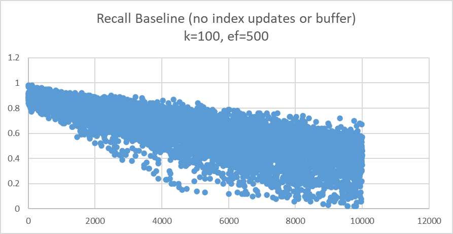
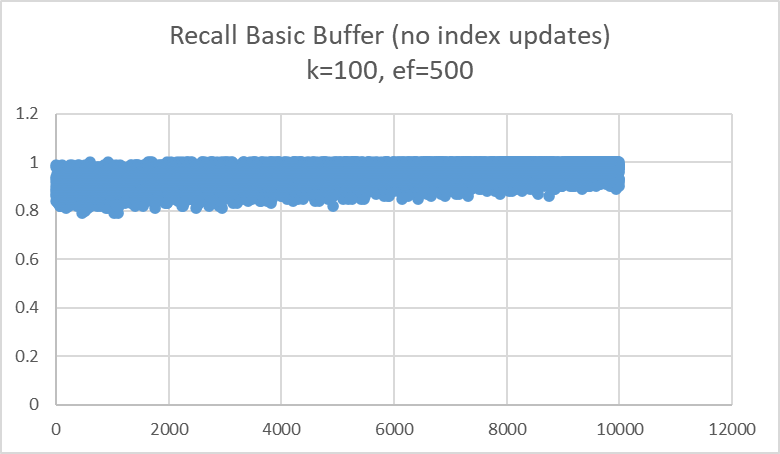

# Test Data

### sequential_insert_baseline
The database vectors are generated using gaussian-like random. The queries are generated with temporal locality. That is, the vectors are close to one another by random gaussian distribution.

# Experiments

### baseline_experiment

This experiment involved having client A insert new vectors while client B queries top k after each insert. The index is not updated so we expect the accuracy to decrease.

To run
```
python -m experiments.baseline_experiment.run --base .\testcases\sequential_insert_baseline\base_vectors\base_vectors.fbin --query .\testcases\sequential_insert_baseline\query_vectors\query_vectors.fbin --k 100 --ef 500
```


### buffer_experiment
This experiment adds a basic buffer to the baseline. The index is not changed ever. For each query, simply use the old index to get topk, then replace the furthest vectors with closer vectors from the buffer.

To run
```
python -m experiments.buffer_experiment.run --base .\testcases\sequential_insert_baseline\base_vectors\base_vectors.fbin --query .\testcases\sequential_insert_baseline\query_vectors\query_vectors.fbin --k 100 --ef 500
```
