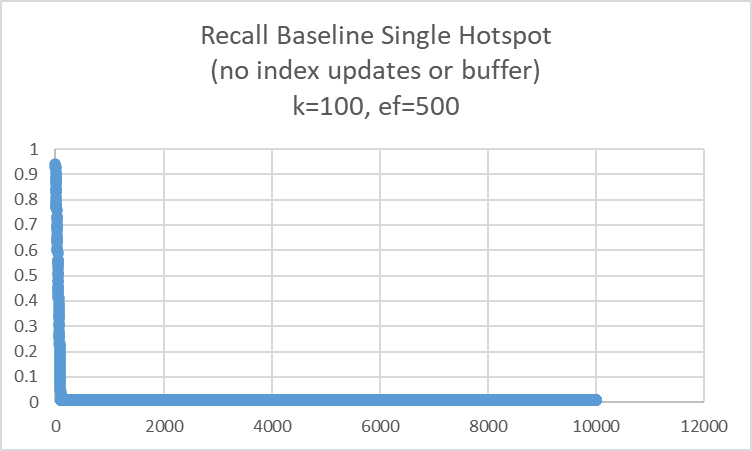
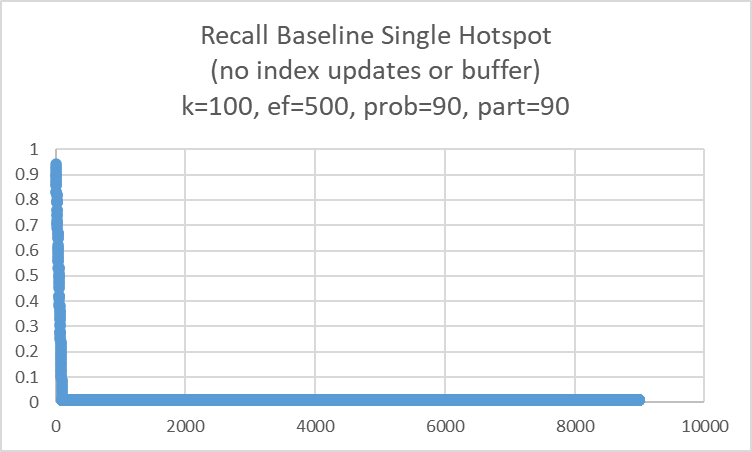
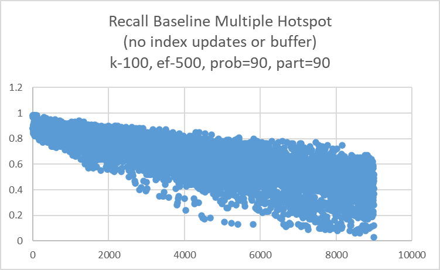
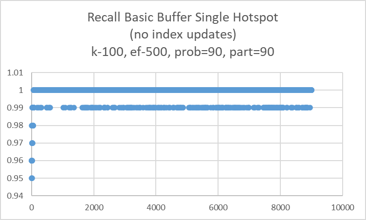
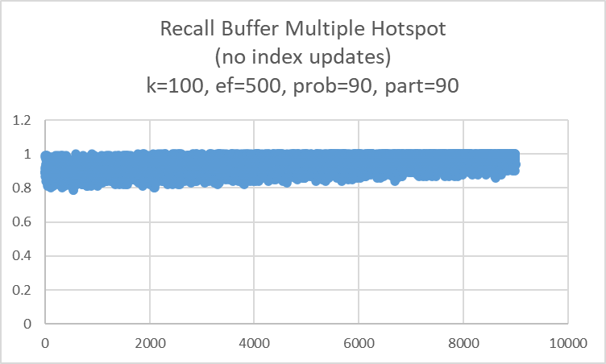

# Test Data

### sequential_insert_baseline
The database vectors are generated using gaussian-like random. The queries are generated with temporal locality. That is, the vectors are close to a single base vector by random gaussian distribution.

### sequential_insert_multiple_hotspots
The database vectors are randomly generated. The query vectors are generated with hotspot locality. There are multiple hotspots represents various popular topics.

# Experiments

### Baseline Experiment

This experiment involved having client A insert new vectors while client B queries top k after each insert. The index is not updated so we expect the accuracy to decrease.

To run
```
python -m experiments.baseline_experiment.run --base .\testcases\sequential_insert_baseline\base_vectors\base_vectors.fbin --query .\testcases\sequential_insert_baseline\query_vectors\query_vectors.fbin --k 100 --ef 500
```

This is the result of multiple insert hotspots with temporal locality for each query ie query after insert.


The graph below is with single hotspot inset and temporal locality query ie query after insert.




The graphs below include probabilistic temporal distribution. It takes two parameters, percentage, and partition. Partition is what percentage of the query vectors will be inserted. Percentage is the percentage of how many of the query vectors come from already inserted vectors, with replacement. The rest of the query vectors come from the remaining partition that will never be inserted.

To run:

```
python -m experiments.baseline_experiment.run_probability --base ./testcases/sequential_insert_baseline/base_vectors/base_vectors.fbin  --query ./testcases/sequential_insert_baseline/query_vectors/query_vectors.fbin  --k 100 --ef 500 --partit
ion 90 --probability 90
```

The graph below is single hotspot:



The graph below is for multiple hotspots:



### Buffer Experiment
This experiment adds a basic buffer to the baseline. The index is not changed ever. For each query, simply use the old index to get topk, then replace the furthest vectors with closer vectors from the buffer.

To run
```
python -m experiments.buffer_experiment.run --base ./testcases/sequential_insert_baseline/base_vectors/base_vectors.fbin  --query ./testcases/sequential_insert_baseline/query_vectors/query_vectors.fbin --k 100 --ef 500
```

The graph below is with multiple insert hotspots and each query has temporal locality ie query after insert.


The graph below is with single hotspot inset and temporal locality query ie query after insert. 


The graphs below are with probabilitistic termporal query insert/query, with probability = 90, and partition = 90.

The graph below is for single hotspot:



The graph below is for multiple hotspots:


